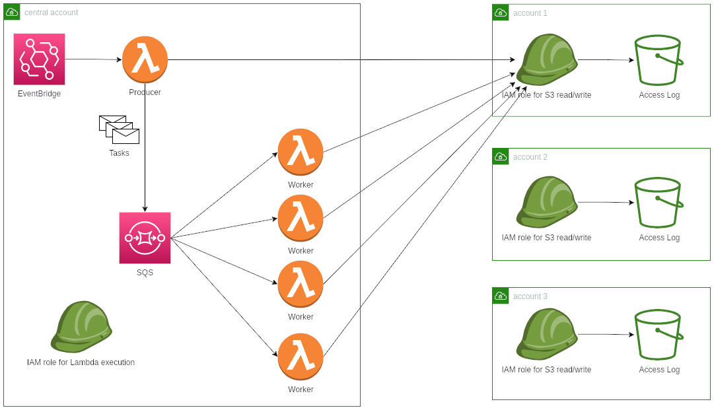

# Terraform AWS S3 access log roller module

## Introduction

When [server access logging](https://docs.aws.amazon.com/AmazonS3/latest/userguide/ServerLogs.html) is enabled for a frequently accessed bucket, a large number of log files are generated per day. Due to the small size and large quantity of these files, it is not suitable to transition them into "cheaper" [storage classes](https://aws.amazon.com/s3/storage-classes/) like Standard-IA or Glacier.

The module deploys a serverless app to reduce the storage cost of these access log files by compressing multiple files into one tarball. Compressed files are ~8% of original size, and have larger size and smaller quantity, making them eligible for cheaper storage classes and save even more costs.

## Architecture

The app is designed to run in a [multi-account setup](https://docs.aws.amazon.com/whitepapers/latest/organizing-your-aws-environment/basic-organization.html). The app assumes IAM roles in other accounts to read/write S3 buckets. The producer lists files from buckets and put tasks into an SQS queue, and the queue invokes workers to do the tasks.

It is suggested to run a copy of app in each region, as S3 charges for inter-region traffic.



## Usage

```hcl
module "s3-access-log-roller" {
  source = "./modules/terraform-aws-s3-access-log-roller"

  slug = "us-west-2"

  maximum_concurrency = 10
  memory_size         = 1024

  # Allow the app to assume these roles
  s3_access_roles = [
    "arn:aws:iam::111111111111:role/s3-rollup-bucket-access", # dev
    "arn:aws:iam::222222222222:role/s3-rollup-bucket-access", # staging
    "arn:aws:iam::333333333333:role/s3-rollup-bucket-access", # prod
  ]

  # Run the app daily
  enable_eventbridge_schedule = true
  eventbridge_invocation_payload = {
    dev = jsonencode({
      s3_role = "arn:aws:iam::111111111111:role/s3-rollup-bucket-access"
      prefixes = [
        "s3://dev-logs/s3/",
      ]
    })
    staging = jsonencode({
      s3_role = "arn:aws:iam::222222222222:role/s3-rollup-bucket-access"
      prefixes = [
        "s3://staging-logs/s3/",
      ]
    })
    prod = jsonencode({
      s3_role = "arn:aws:iam::333333333333:role/s3-rollup-bucket-access"
      prefixes = [
        "s3://prod-logs/s3/",
      ]
    })
  }
}
```

<!-- BEGIN_TF_DOCS -->
## Requirements

| Name | Version |
|------|---------|
| <a name="requirement_terraform"></a> [terraform](#requirement\_terraform) | >= 1.0 |
| <a name="requirement_archive"></a> [archive](#requirement\_archive) | >= 2.0 |
| <a name="requirement_aws"></a> [aws](#requirement\_aws) | >= 4.0 |

## Providers

| Name | Version |
|------|---------|
| <a name="provider_archive"></a> [archive](#provider\_archive) | 2.4.0 |
| <a name="provider_aws"></a> [aws](#provider\_aws) | 5.10.0 |

## Modules

No modules.

## Resources

| Name | Type |
|------|------|
| [aws_iam_role.main](https://registry.terraform.io/providers/hashicorp/aws/latest/docs/resources/iam_role) | resource |
| [aws_iam_role_policy.main](https://registry.terraform.io/providers/hashicorp/aws/latest/docs/resources/iam_role_policy) | resource |
| [aws_lambda_event_source_mapping.main](https://registry.terraform.io/providers/hashicorp/aws/latest/docs/resources/lambda_event_source_mapping) | resource |
| [aws_lambda_function.main](https://registry.terraform.io/providers/hashicorp/aws/latest/docs/resources/lambda_function) | resource |
| [aws_scheduler_schedule.main](https://registry.terraform.io/providers/hashicorp/aws/latest/docs/resources/scheduler_schedule) | resource |
| [aws_sqs_queue.dlq](https://registry.terraform.io/providers/hashicorp/aws/latest/docs/resources/sqs_queue) | resource |
| [aws_sqs_queue.main](https://registry.terraform.io/providers/hashicorp/aws/latest/docs/resources/sqs_queue) | resource |
| [archive_file.lambda](https://registry.terraform.io/providers/hashicorp/archive/latest/docs/data-sources/file) | data source |
| [aws_iam_policy_document.assume_role](https://registry.terraform.io/providers/hashicorp/aws/latest/docs/data-sources/iam_policy_document) | data source |
| [aws_iam_policy_document.main](https://registry.terraform.io/providers/hashicorp/aws/latest/docs/data-sources/iam_policy_document) | data source |
| [aws_region.current](https://registry.terraform.io/providers/hashicorp/aws/latest/docs/data-sources/region) | data source |

## Inputs

| Name | Description | Type | Default | Required |
|------|-------------|------|---------|:--------:|
| <a name="input_enable_eventbridge_schedule"></a> [enable\_eventbridge\_schedule](#input\_enable\_eventbridge\_schedule) | If true, producer Lambda scans S3 prefixes every day to make tasks. | `bool` | `true` | no |
| <a name="input_ephemeral_storage_size"></a> [ephemeral\_storage\_size](#input\_ephemeral\_storage\_size) | Lambda function ephemeral storage size in MiB. | `number` | `10240` | no |
| <a name="input_eventbridge_invocation_payload"></a> [eventbridge\_invocation\_payload](#input\_eventbridge\_invocation\_payload) | Map of account alias => JSON payload to pass to Lambda function by EventBridge. | `map(string)` | `{}` | no |
| <a name="input_maximum_concurrency"></a> [maximum\_concurrency](#input\_maximum\_concurrency) | How many Lambda function instances can be launched concurrently by SQS. | `number` | `10` | no |
| <a name="input_memory_size"></a> [memory\_size](#input\_memory\_size) | Lambda function memory size in MiB. | `number` | `1024` | no |
| <a name="input_runtime"></a> [runtime](#input\_runtime) | Labmda function runtime. See: https://docs.aws.amazon.com/lambda/latest/dg/lambda-runtimes.html | `string` | `"python3.8"` | no |
| <a name="input_s3_access_roles"></a> [s3\_access\_roles](#input\_s3\_access\_roles) | ARNs of IAM roles that the function assume to read/write S3 buckets. These child roles can only be created after the parent role is created. | `list(string)` | n/a | yes |
| <a name="input_security_group_ids"></a> [security\_group\_ids](#input\_security\_group\_ids) | IDs of security groups to attach to Lambda function. Only valid if var.subnet\_ids is not null. | `list(string)` | `null` | no |
| <a name="input_slug"></a> [slug](#input\_slug) | Used for naming resources. | `string` | n/a | yes |
| <a name="input_sqs_message_retention_seconds"></a> [sqs\_message\_retention\_seconds](#input\_sqs\_message\_retention\_seconds) | How long the message stays in queue before being purged. | `number` | `1209600` | no |
| <a name="input_sqs_visibility_timeout"></a> [sqs\_visibility\_timeout](#input\_sqs\_visibility\_timeout) | How long the message stays invisible when it has been received. Must be greater than Lambda timeout. | `number` | `900` | no |
| <a name="input_subnet_ids"></a> [subnet\_ids](#input\_subnet\_ids) | IDs of subnets to run Lambda function in. If null, Lambda runs in Amazon-managed VPC. | `list(string)` | `null` | no |
| <a name="input_timeout"></a> [timeout](#input\_timeout) | Lambda function timeout in seconds. | `number` | `600` | no |

## Outputs

No outputs.
<!-- END_TF_DOCS -->
